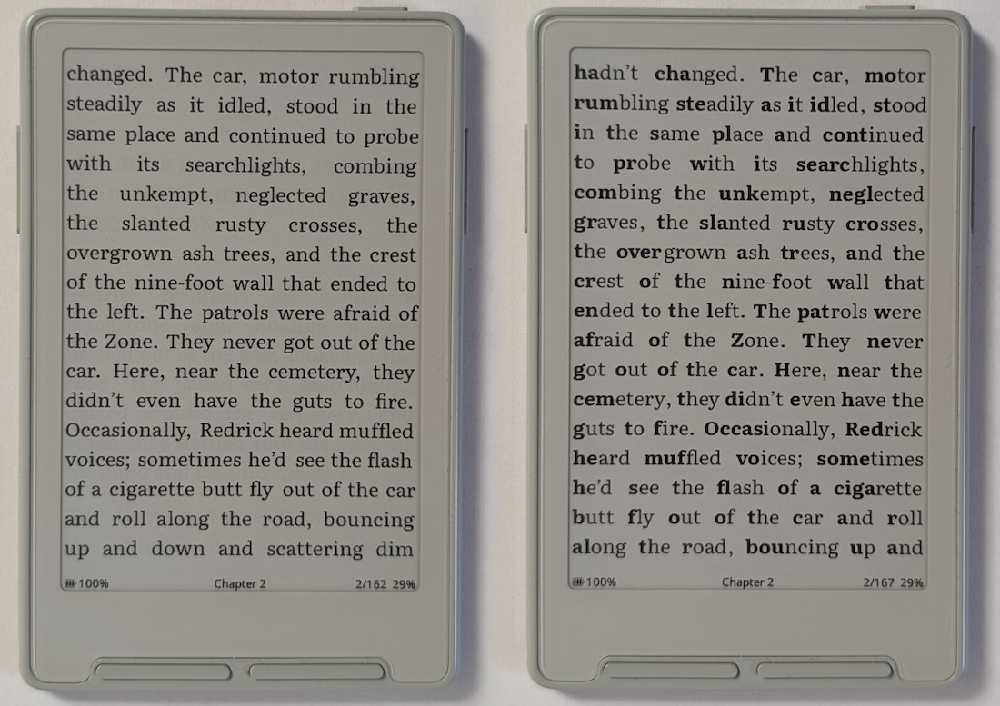
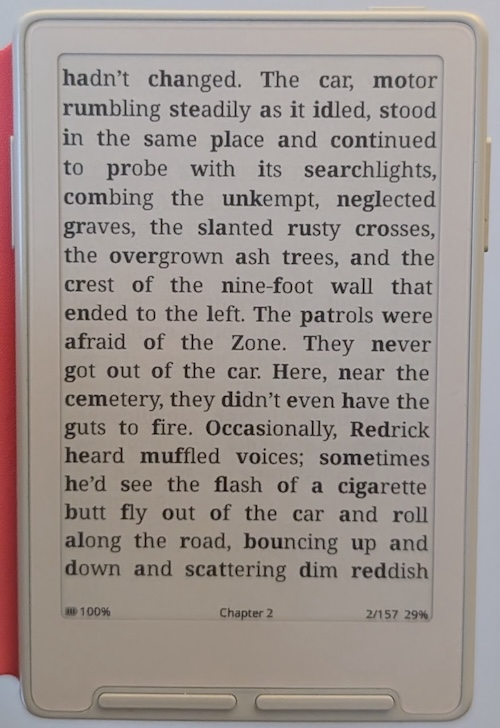
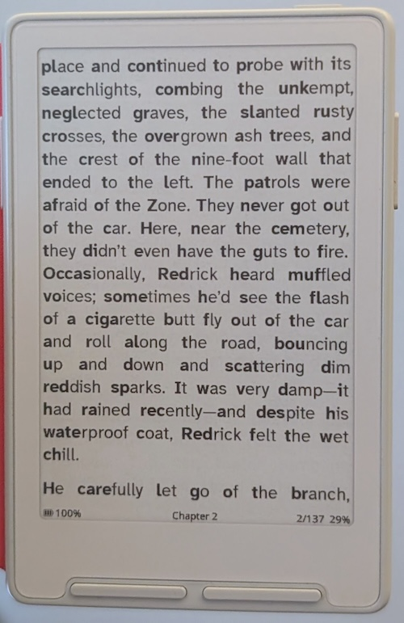

# Bionic Reading

Bionic Reading is a reading aid that bolds the first portion of each word, guiding your eyes to natural fixation points and helping you read faster with less effort. Some readers - particularly those with ADHD - find it helps them stay engaged with the text and reduces mind-wandering.

*Left: Bionic Reading off. Right: Bionic Reading on. Both using Literata.*

## Enabling Bionic Reading

1. Open **Settings > Reader**
2. Toggle **Bionic Reading** on

Toggling the setting will trigger a re-index of your current book, the same as when changing font settings. Once indexing is complete, page turns proceed as normal. No changes are made to your EPUB files.

## Examples

*Bionic Reading with Noto Serif font*

*Bionic Reading with Merriweather font*

*Bionic Reading with Atkinson Hyperlegible Next font*

## Notes

- Bionic Reading only applies to regular body text. Already-bold text (headings, emphasis) is left unchanged.
- The setting is per-device, not per-book — it applies to all books while enabled.
